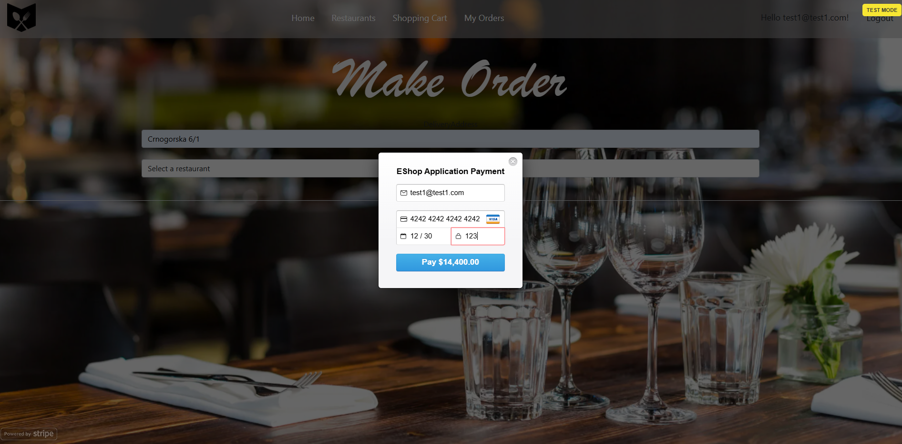
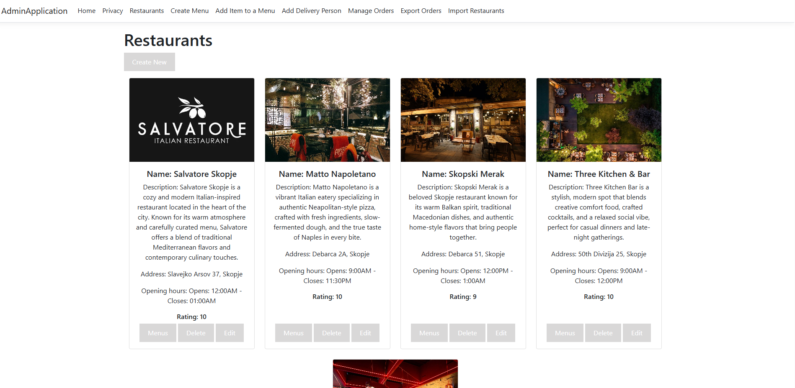

# 🍽️ DineMaster
## A complete end-to-end restaurant ordering ecosystem — from customer browsing to admin management, payments, invoices & data import/export.

 

✨ Client App (End-User) + 👨‍💼 Admin App (SuperUser)
 · 💳 Stripe Payments · 📄 PDF Invoice Export · 📊 Excel Import/Export
🔗 REST API communication between apps

 

## ✨ Client App (End-User)

  

 

## 💳 Stripe Payments

   

 

## 👨‍💼 Admin App (SuperUser)

   

 

<!-- 

                         ┌─────────────────────────┐
                         │     Client App (MVC)     │
                         │  Restaurants · Cart ·     │
                         │  Orders · Stripe Payment  │
                         └───────────▲──────────────┘
                                     │ REST API Calls
                                     │
                         ┌───────────┴──────────────┐
                         │  Client API Controllers   │
                         │ (.NET Web API Layer)      │
                         └───────────▲──────────────┘
                                     │
                         ┌───────────┴──────────────┐
                         │    Admin Application      │
                         │  Create menus, items,     │
                         │  export, import, invoices │
                         └───────────────────────────┘

Database: SQL (shared)
Payments: Stripe
Invoices: DOCX → PDF Export

  

 -->

  

Link: [dinemaster.azurewebsites.net](https://dinemaster.azurewebsites.net/)

